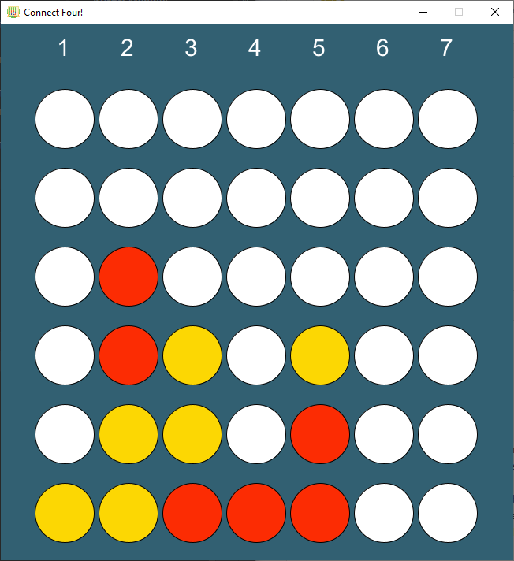

## Vier Gewinnt! (PIS SS 2021)
<p><strong>Autor:</strong> Mehmet Tercüman, 5296149</p>

### Beschreibung:
Mein Spiel ist das klassische Vier gewinnt. <br>
Ziel des Spieles ist es, vier eigene Steine horizontal, diagonal 
oder waagerecht in eine Linie zu bringen. <br>
Gleichzeitig muss man aber auch verhindern, dass der Gegner nicht dasselbe 
schafft. <br>
Das Spielfeld besteht aus 7 Spalten und 6 Reihen, es wird abwechselnd gespielt. <br>
Wird eine Spalte für einen Zug ausgewählt, rutscht der Stein bis zum untersten
freien Platz in der Spalte. <br>
Das Spiel endet unentschieden, wenn alle Felder voll sind, ohne dass ein Spieler 
eine Linie mit vier Steinen bilden konnte. (87 Wörter) <br>

<br>

### Screenshot einer Partie:

<br>
<br>

### Bedienungshinweise:
Zu Beginn des Spieles wird mit den Tasten `B` und `P` ausgewählt, 
ob man gegen einen Bot (B) oder gegen einen anderen Player (P) spielen möchte. <br>
Danach beginnt das Spiel und man kann mit den Tasten `1-7` eine Zeile auswählen, wo der Stein gesetzt werden soll. <br>
Falls man aus Versehen einen falschen Zug gespielt hat, kann man ihn mit der Taste `U` rückgängig machen. <br>
Wenn man das Spiel zurücksetzen möchte, kann man die Taste `R` drücken und das ganze Spiel wird zurückgesetzt. <br>
<br>

### Dateiübersicht und LOC:
```
> dir /S /B /A-D . 
\img.png
\README.md
\settings.gradle
\app\build.gradle
\app\core.jar
\app\src\main\java\PIS_HU1\Draw.java
\app\src\main\java\PIS_HU1\GameEngine.java
\app\src\main\java\PIS_HU1\GameInterface.java
\app\src\main\resources\connect-four.png
\app\src\main\resources\robot.png
\app\src\main\resources\TitleScreen.png
\app\src\main\resources\winner.png
\app\src\test\java\PIS_HU1\AppTest.java

-----------------------------------------------------------------------------------------------
File                                                        blank        comment           code
-----------------------------------------------------------------------------------------------
app\src\main\java\pis_hu1\gameengine.java                      22              9            144
app\src\main\java\pis_hu1\draw.java                            12              0            132
app\src\main\java\pis_hu1\gameinterface.java                    1              0              8
-----------------------------------------------------------------------------------------------
SUM:                                                           35              9            284
-----------------------------------------------------------------------------------------------

AL : 53,52% 
```
<br>

### Quellen:
https://processing.org/reference/ (Abruf: 15.6.21) <br>
https://github.com/denkspuren/BitboardC4/blob/master/BitboardDesign.md (Abruf: 18.6.21) <br>
https://www.youtube.com/watch?v=CjldSexfOuU (Abruf 22.6.21) <br>
https://forum.processing.org/two/discussion/8879/how-can-i-have-a-starting-screen-for-a-game  (Abruf 24.06.21) <br>
Icon made by Dighital from Flaticon https://www.flaticon.com/search/2?word=board%20games&type=icon  (Abruf 25.06.21) <br>
Icon made by Freepik from Flaticon https://www.flaticon.com  (Abruf 25.06.21) <br>
https://www.pinclipart.com/search.html?k=connect+four (Abruf 27.06.21) <br>
https://freepngimg.com/png/72964-euclidean-vector-robot-png-free-photo (Abruf 27.06.21) <br>
https://www.pinclipart.com/pindetail/mhoRTm_connect-four-clipart/ (Abruf 27.06.21) <br>
https://forum.processing.org/one/topic/keycode-in-switch-statement.html (Abruf 28.06.21) <br>
READ.me Template zur Abgabe (Abruf 01.07.21) <br>