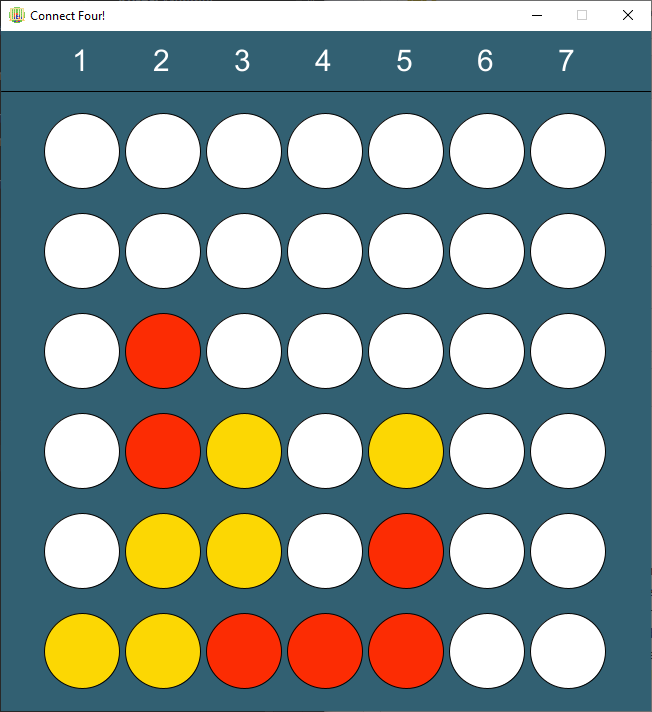

<h2>Vier Gewinnt! (PIS SS 2021)</h2>

<strong>Autor:</strong> Mehmet Tercüman, 5296149

<h3>Beschreibung:</h3>
Mein Spiel ist das klassische Vier gewinnt.  
Ziel des Spieles ist es, vier eigene Steine horizontal,diagonal 
oder waagerecht in eine Linie zu bringen.  
Gleichzeitig muss man aber auch verhindern, dass der Gegner nicht das Selbe 
schafft.  
Es wird abwecheselnd auf ein 7 x 7 Felder großes Feld Steine gesetzt, 
wird eine Spalte für ein Zug ausgewählt, rutscht der Stein bis zum unsersten
freien Platz in der Spalte.  
Das Spiel endet unentschieden, wenn alle Felder voll sind, ohne dass ein Spieler 
eine Viererlinie gebildet hat. (84 Wörter)  

 

<h3>Screenshot einer Partie:</h3>

 
 

<h3>Bedienungshinweise:</h3>
Zu Beginn des Spieles wird mit den Tasten P und B ausgewählt, 
ob man gegen einen Bot (B) spielen möchte oder gegen einen anderen Player (P).  
Danach beginnt das Spiel und man kann mit den Tasten 1-7 eine Zeile auswählen, wo der Stein gesetzt werden werden soll.  
Falls man aus Versehen einen falschen Zug gespielt hat, kann man ihn mit der Taste U rückgängig machen.  
Wenn man das Spiel zurücksetzen möchte, kann man die Taste R drücken und das ganze Spiel wird zurückgesetzt.  
 

<h3>Dateiübersicht und LOC:</h3>

> dir /S /B /A-D .  
C:\PIS_HU1\app\build.gradle
C:\PIS_HU1\app\core.jar
C:\PIS_HU1\app\README.md
C:\PIS_HU1\app\Pictures
C:\PIS_HU1\app\src\main\java\PIS_HU1\Draw.java
C:\PIS_HU1\app\src\main\java\PIS_HU1\GameEngine.java
C:\PIS_HU1\app\src\main\java\PIS_HU1\GameInterface.java
C:\PIS_HU1\app\src\test\java\PIS_HU1\AppTest.java

 

<h3>Quellen:</h3>

